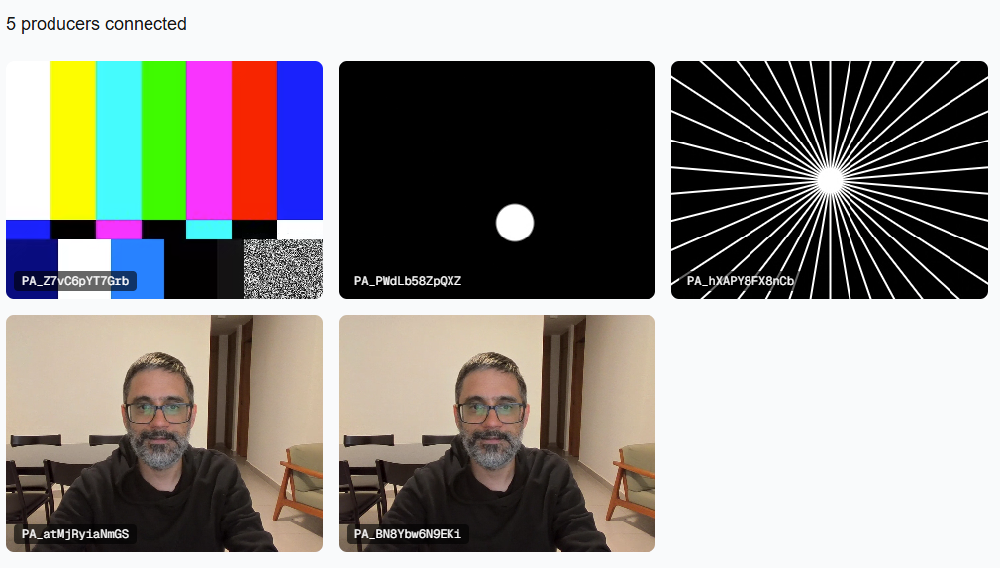
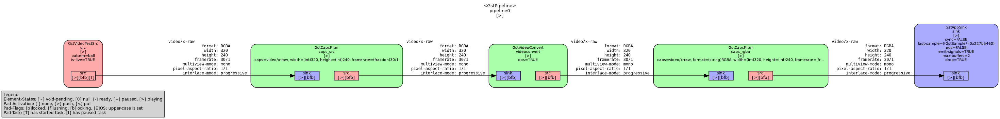

# webrtc-grid-demo-livekit

## What it is

A WebRTC fan-out demo built with Next.js, GStreamer and [LiveKit](https://livekit.io/). It shows how to inject external video into the browser via WebRTC, supporting N producers and N consumers.

This is a fork of [webrtc-grid-demo](https://github.com/dkprog/webrtc-grid-demo). The original wires every peer together in a WebRTC mesh; this version instead uses **LiveKit as an SFU** (Selective Forwarding Unit). My goal was to learn LiveKit.

### What changed from the original

- **No signaling server.** LiveKit handles signaling, ICE and the media routing, so the agnostic socket.io server is gone.
- **`gst-producer` got much simpler.** The mesh version had to spin up a `webrtcbin` branch and renegotiate for *each consumer* that connected. With an SFU the producer publishes a single track once; the SFU fans it out to every consumer. No per-consumer branches, no `tee`, no dynamic linking.
- **Still N producers and N consumers.** But now thanks to the SFU instead of a full mesh.

## Components

### Next.js app



- Consumer: initial screen for consumers (`/`). Subscribes to the room and renders every published camera track in a grid.
- Producer (`/producer`): open in another tab to publish a browser webcam into the room.

Both roles join the same LiveKit room and fetch their access token from the LiveKit sandbox token server.

### gst-producer

Python process using GStreamer and the [LiveKit Python SDK](https://github.com/livekit/python-sdks) (`livekit==1.1.9`) to publish a synthetic video track into the room.

The LiveKit Python SDK at this version does **not** accept already-encoded payloads, so the pipeline produces raw **RGBA** frames and pushes them as `rtc.VideoFrame` into a `rtc.VideoSource`. LiveKit then handles encoding and publishing. GStreamer runs on a `GLib.MainLoop` while the LiveKit room runs on an asyncio loop in a separate thread.

`docker-compose.yml` starts three of these, each with a different `videotestsrc` pattern (`ball`, `smpte`, `spokes`) to populate the consumer grid.



## Configuration

Both services read their LiveKit connection details from environment files (gitignored). Create them before running:

`gst-producer/.env`

```sh
LIVEKIT_URL=wss://<your-project>.livekit.cloud
LIVEKIT_TOKEN_SERVER_ID=<your-sandbox-token-server-id>
```

`web/.env`

```sh
NEXT_PUBLIC_LIVEKIT_URL=wss://<your-project>.livekit.cloud
NEXT_PUBLIC_LIVEKIT_TOKEN_SERVER_ID=<your-sandbox-token-server-id>
```

## How to run

```sh
docker compose build
docker compose up
```

Then open http://localhost:3000 for the consumer grid and http://localhost:3000/producer for the browser producer.
