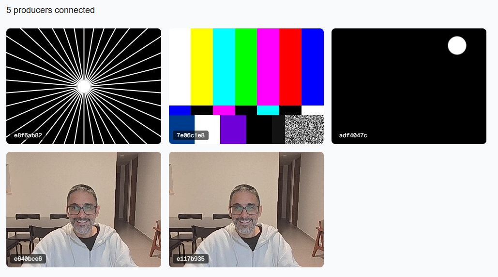

# webrtc-grid-demo

## What it is

A WebRTC fan-out demo built with Next.js, socket.io and GStreamer. It shows how to inject external video into the browser via WebRTC, supporting N producers and N consumers.

## Components

### Next.js app



- Consumer: initial screen for consumers (`/`).
- Producer (`/producer`): open in another tab to test browser-based injection.

### Signaling server

Agnostic websocket server for event relay, built with Bun, TypeScript and socket.io.

### gst-producer

Python process using GStreamer and python-socketio to build pipelines. The trick: a single source/encoder feeds a `tee`, and new `webrtcbin` branches are added and linked to the tee dynamically as consumers connect, then torn down on disconnect. This keeps one encoder running while fanning out to N consumers at runtime.


## Protocol

The session is split between consumers and producers. Producers initiate the call to every consumer they see: when a consumer connects, each producer creates a peer connection, sends an offer, receives an answer, and both sides trickle ICE candidates until connected. On disconnect, the peers tear down their connections.

The signaling server is otherwise agnostic to WebRTC. Its only role-specific behavior is broadcasting `consumer-connected` / `consumer-disconnected` / `producer-disconnected` so peers know who to talk to. Everything else (offer, answer, ICE candidates) is wrapped in a single `message` event with shape `{ to, kind, payload }` and forwarded blindly based on `to`.

## How to run

```sh
docker compose build
docker compose up
```

Then open http://localhost:3000 for the consumer view and http://localhost:3000/producer for the browser producer.
